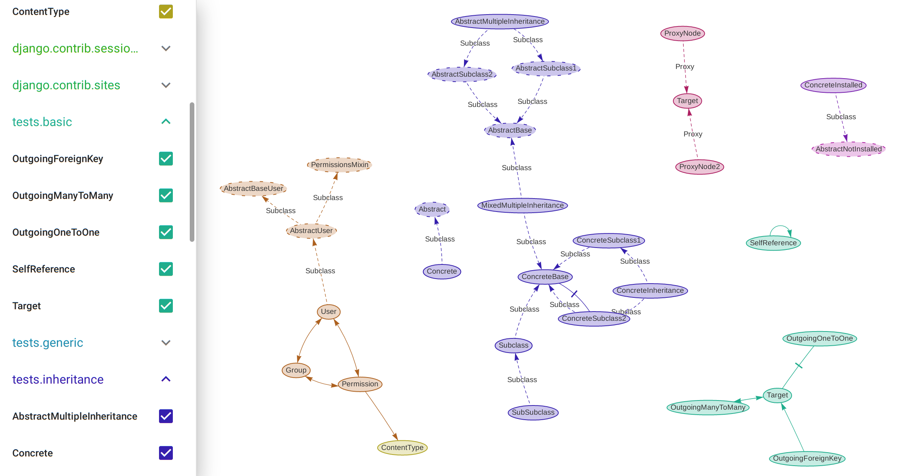

# Django Schema Graph

Django-schema-graph makes a colourful diagram out of your Django models. The
diagram is interactive, and makes it easy to toggle models and apps on/off at
will.

It looks like this:



(Apologies that the image above doesn't work on PyPI. [Check it out on
GitHub](https://github.com/meshy/django-schema-graph/blob/master/README.md).)


## Installation

Install from PyPI:

```bash
pip install django-schema-graph
```

Add to `INSTALLED_APPS`:

```python
INSTALLED_APPS = [
    ...
    'schema_graph',
    ...
]
```

Add to your URLs.

```python
from schema_graph.views import Schema
urlpatterns += [
    # On Django 2+:
    path("schema/" Schema.as_view()),
    # Or, on Django < 2:
    url(r"^schema/$", Schema.as_view()),
]
```

## Use

Browse to `/schema/` (assuming that's where you put it in your URLs).

Note: `DEBUG` mode is required, on the assumption that you don't want to leak
sensitive information about your website outside of local development.

# Support

Tested with Django 1.8, and 1.11 - 3.0 on Python 2.7 and 3.5 - 3.8 (where those
combinations make sense).

## Alternatives

- [`django-spaghetti-and-meatballs`](https://github.com/LegoStormtroopr/django-spaghetti-and-meatballs)
  is great. At the time of writing, it offers a lot more detailed information
  on the models in the diagram, but doesn't allow them to be turned on/off in
  the page.
