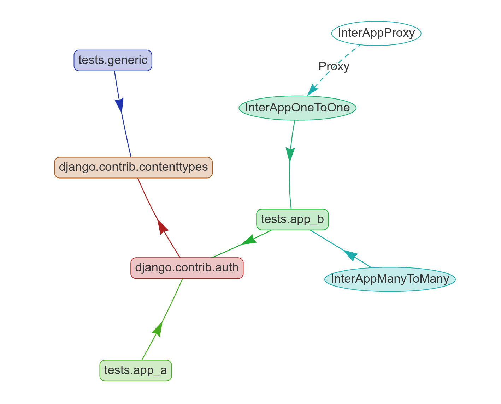
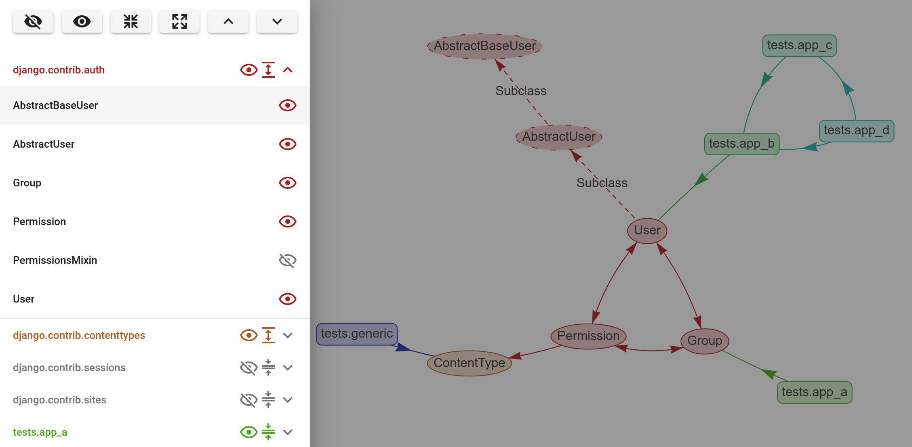

# Django Schema Graph

Django-schema-graph makes a colourful diagram out of your Django models. The
diagram is interactive, and makes it easy to toggle models and apps on/off at
will.

It looks like this:

| Feature       | Screenshot |
| ---           | --- |
| Models        |  |
| Apps          |  |
| Both together |  |
| Graph editor  |  |

(Apologies that the images above don't work on PyPI. [Check it out on
GitHub](https://github.com/meshy/django-schema-graph/blob/master/README.md).)


## Installation

Install from PyPI:

```bash
pip install django-schema-graph
```

Add to `INSTALLED_APPS`:

```python
INSTALLED_APPS = [
    ...
    'schema_graph',
    ...
]
```

Add to your URLs.

```python
from schema_graph.views import Schema
urlpatterns += [
    # On Django 2+:
    path("schema/", Schema.as_view()),
    # Or, on Django < 2:
    url(r"^schema/$", Schema.as_view()),
]
```

## Use

Browse to `/schema/` (assuming that's where you put it in your URLs).

You can control access to this page using the `SCHEMA_GRAPH_VISIBLE` setting,
or by subclassing `schema_graph.views.Schema` and overriding `access_permitted`.
By default the page is only visible when `DEBUG` is `True`,
because we assume that you don't want to leak sensitive information about your
website outside of local development.

## Support

Tests run on sensible combinations of:
- Python (3.6-3.10)
- Django (1.11-4.0)

If you're stuck on old version of Python or Django, you may consider installing
old versions.
They will probably have fewer features, and there will be no support for them.

The last version to support Python 2.7 and 3.5 was 1.2.0

The last version to support Django 1.8 was 1.2.0

## Alternatives

- [`django-spaghetti-and-meatballs`](https://github.com/LegoStormtroopr/django-spaghetti-and-meatballs)
  is great. At the time of writing, it offers a lot more detailed information
  on the models in the diagram, but doesn't allow them to be turned on/off in
  the page.
